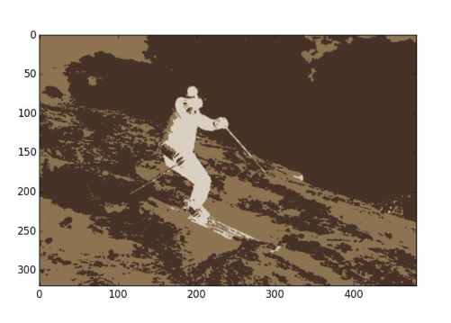
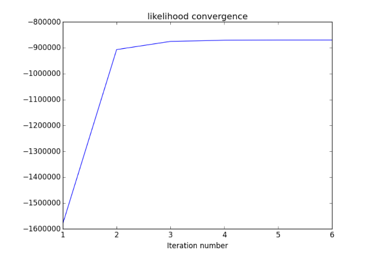

## Gaussian Mixture Model

A Gaussian Mixture Model (GMM) is a parametric probability density function represented as a weighted sum of Gaussian component densities. GMMs are commonly used as a parametric model of the probability distribution of continuous measurements or features. Here the GMM parameters are estimated from the training data using the iterative Expectation Maximization (EM) algorithm and RGB values are used as features.

### Algorithm
- Initialize all the gaussians (3 in this case) with their respective means, variances and mixing coefficients (weights). Each gaussian will represent one cluster.
- Evaluate the reponsibilities using current parameters.
- Re-estimate the parameters using current responsibilities.
- Evaluate the log likelihood.
- Check for convergence of either log likelihood or parameters.

### Results
The algorithm was iteratively applied on an image which resulted in its segmentation.

Original Image

  

Segmented Image

  

Graph showing convergence of log likelihood value

  

