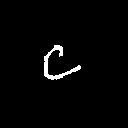
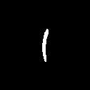

## Bayesian Classifier
Maximum likelihood estimation method has been used to estimate the coavriance and mean matrices from the training data which are further used to classify the characters. This method views the parameters as quantities whose values are fixed but unknown. The best estimate of their value is defined to be the one that maximises the probability of obtaining the samples actually observed.

3 generative bayesian classifiers have been constructed here . Difference in classifiers is the covariance matrices which is used to distinguish characters and are as follows:

1. The samples of a given character class are modelled by a separate covariance matrix Σi.
2. The samples across all the characters are pooled to generate a common diagonal covariance matrix Σ. The diagonal entries correspond to the variances of the individual features, that are considered to be independent.
3. The covariance matrix of each class is forced to be identity matrix.

The classifiers were trained with 200 images from each class and were tested upon 100 images from each class.

### Results
#### Classifier 1
Accuracy per class:

Class 1 : **85%**

Class 2: **93%**

Class 3: **100%**

Average accuracy of the classifier: **92.66%**

#### Classifier 2
Accuracy per class:

Class 1 : **86%**

Class 2: **86%**

Class 3: **100%**

Average accuracy of the classifier: **90.66%**

#### Classifier 3
Accuracy per class:

Class 1 : **87%**

Class 2: **86%**

Class 3: **100%**

Average accuracy of the classifier: **91%**

### Classes
Class 1:

  

Class 2:

  

Class 3:

  

