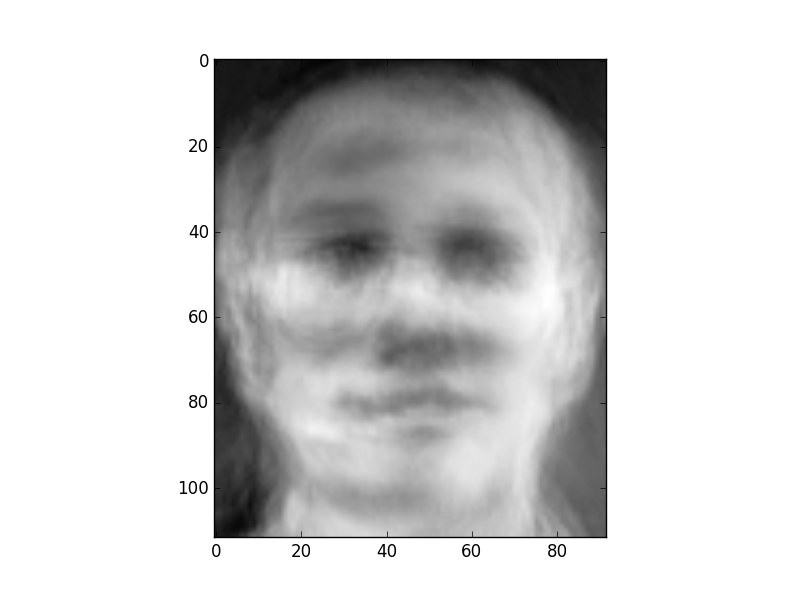
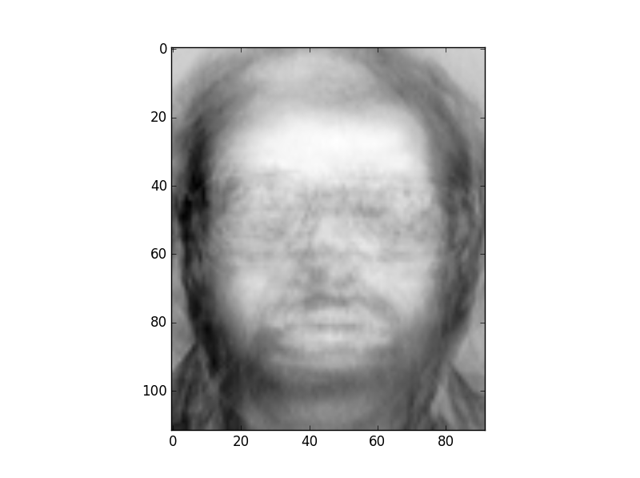
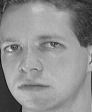
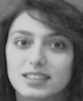
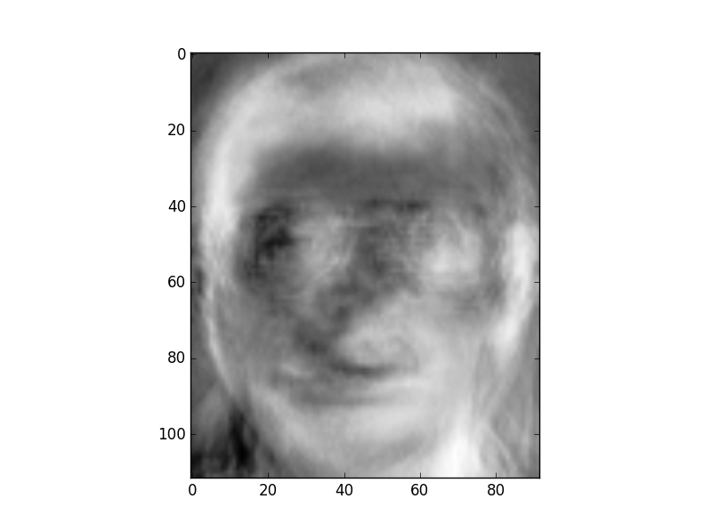
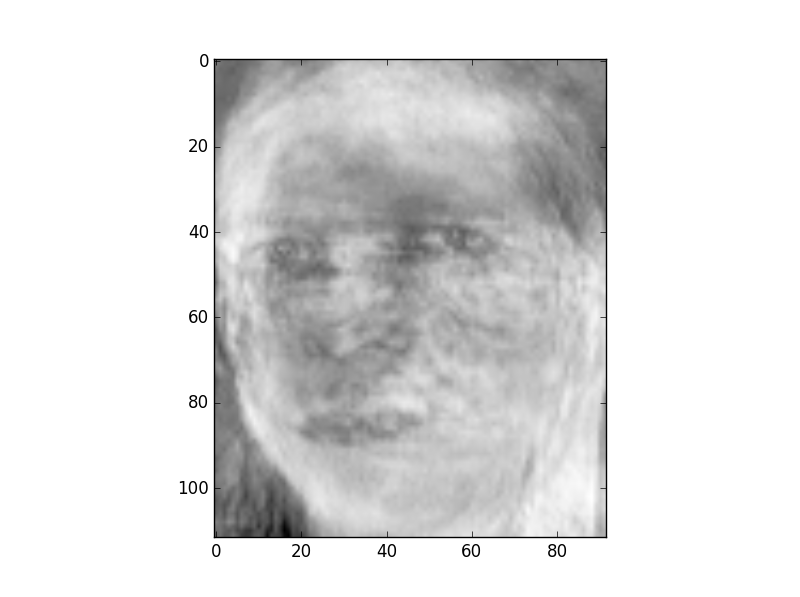
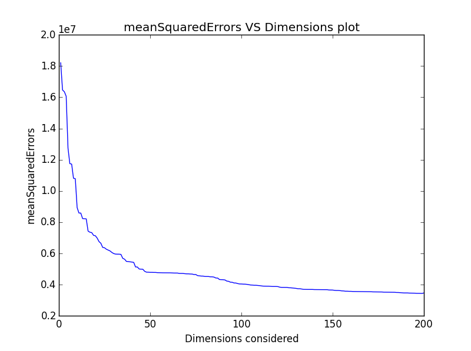
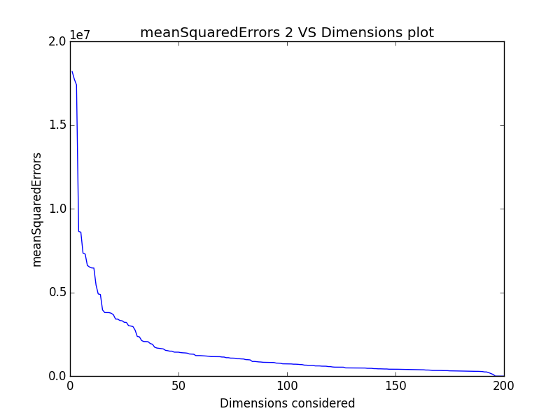

## Principal Component Analysis 
It is the orthogonal projection of the data onto a lower dimensional linear space, known as *principal subspace*, such that the variance of the data projected is minimised. It is also known as the *Karhunen-Loeve* transform. 

Here the pixel intensities of the 200 face images (5 from each of the 40 individuals) used for computing the KL Transform. By employing the method of efficient computation of the basis vectors for high dimensional data, eigen values and corresponding eigen faces are calclated which can be used to reconstruct any face. We generally ignore the eigen faces corresponding to low eigen values to make computations faster.

### Results

#### Top 5 eigen faces (not in order)
 

#### Total variance versus dimensions

Number of dimensions required to cover 95% of the variance : 110

#### Reconstruction

Two input images, given in .pgm format, were reconstructed using some or all of the eigen values. Here are the input images:

         

##### Image 1
Reconstruction using i) Top 1 ii) Top 15 iii) All eigen values

Mean Sqare error versus Dimension

##### Image 2
Reconstruction using i) Top 1 ii) Top 15 iii) All eigen values

Mean Sqare error versus Dimension

**The second test image is reconstructed with more accuracy than the first one because it is already present in the training data set and eigen vectors were calculated with that image as one of the vectors.**
